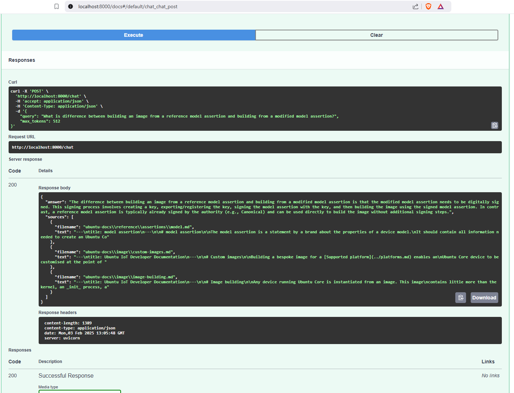
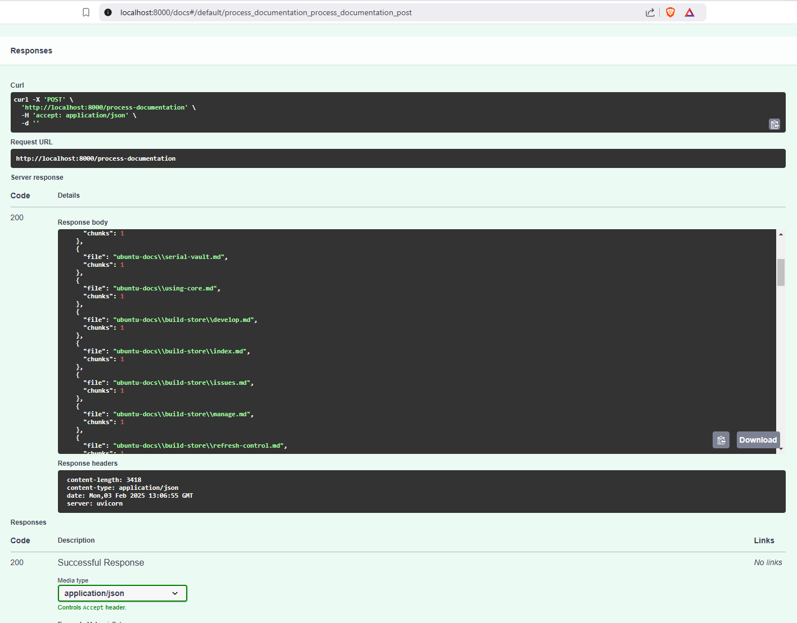
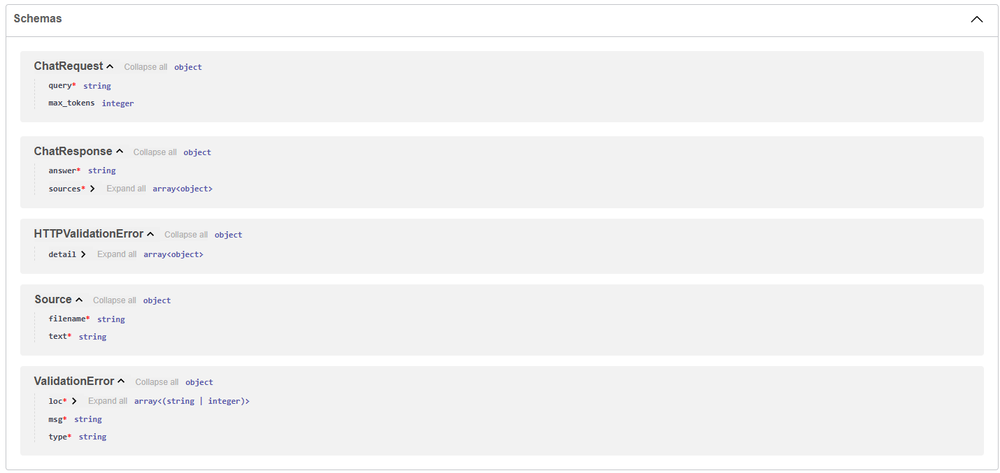

# RAG Chatbot with Mixtral and Faiss

A Retrieval-Augmented Generation (RAG) chatbot that uses Faiss for vector storage and Mixtral 8x7B for generating responses. The system processes Ubuntu documentation and provides accurate, context-aware responses to user queries.

## Features

- Document processing and chunking of Ubuntu documentation
- Vector embeddings using Mistral-Embed
- Efficient similarity search using Faiss
- Context-aware responses using Mixtral 8x7B
- FastAPI backend with Swagger UI

## Setup

1. Install dependencies:
```bash
pip install -r requirements.txt
```

2. Set up environment variables:
Create a `.env` file with (use env.example as a reference):
```
MIXTRAL_API_KEY=your_api_key_here
```

3. Run the application:
```bash
uvicorn app.main:app --reload
```

## API Endpoints

- POST `/chat`: Submit a query and get a context-aware response
- POST `/process-documentation`: Ingest new documentation into the vector store

## Project Structure

- `app/`: Main application directory
  - `main.py`: FastAPI application and endpoints
  - `ingestion.py`: Document processing and indexing
  - `rag.py`: RAG implementation with Faiss and Mixtral
  - `models.py`: Pydantic models for request/response
- `data/`: Directory for storing documentation and vector indices


## Chunking Strategy

The current chunking strategy in the project involves splitting text into manageable chunks for processing. The chunk size is set to **500 characters** for the following reasons:

1. **API Token Limits**: Many NLP APIs, including Mistral, have token limits for input text. A chunk size of 500 characters balances the need to provide enough context while staying within these limits.

2. **Relevance and Context**: Smaller chunks can improve the retrieval process by allowing the system to find more relevant information. However, if chunks are too small, they may lack sufficient context for meaningful responses.

3. **Performance**: A chunk size of 500 is a compromise between processing efficiency and the quality of the embeddings generated. It allows the system to process text in manageable segments without overwhelming the API or the system's memory.


## Screenshots




